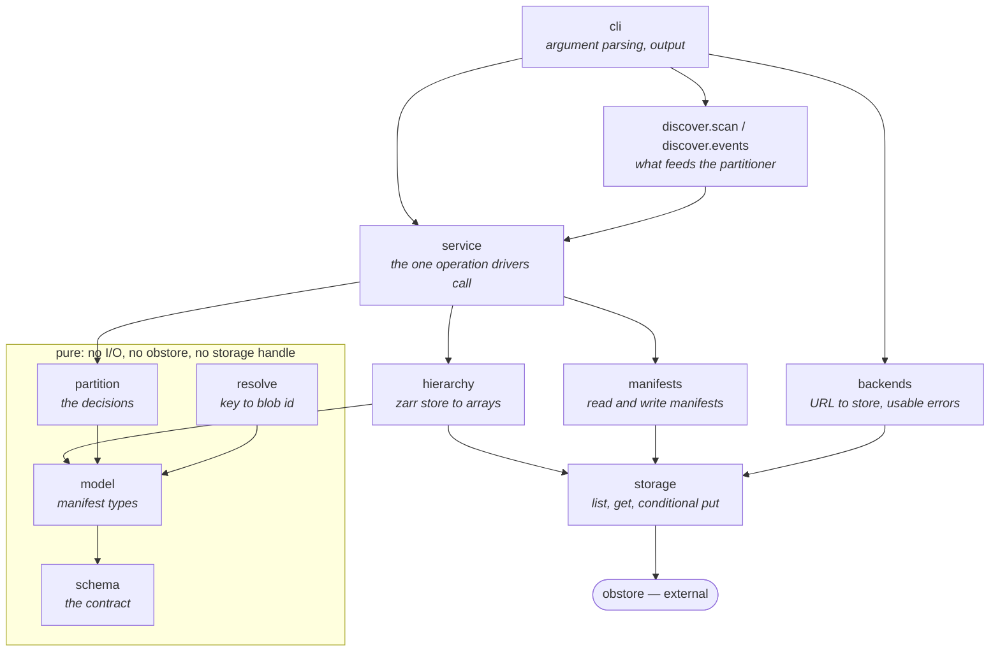
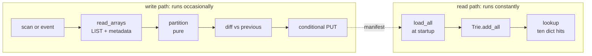
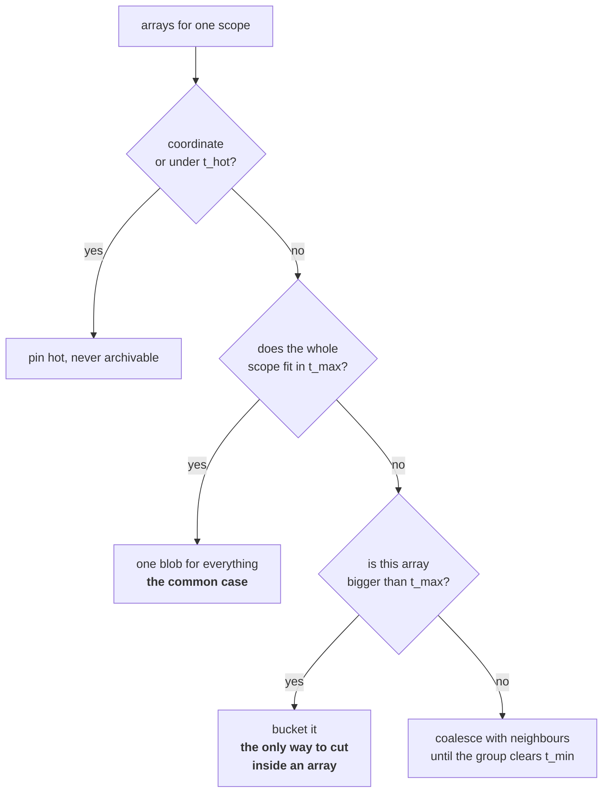
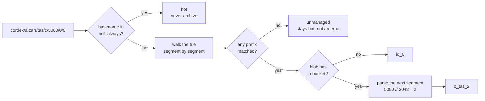
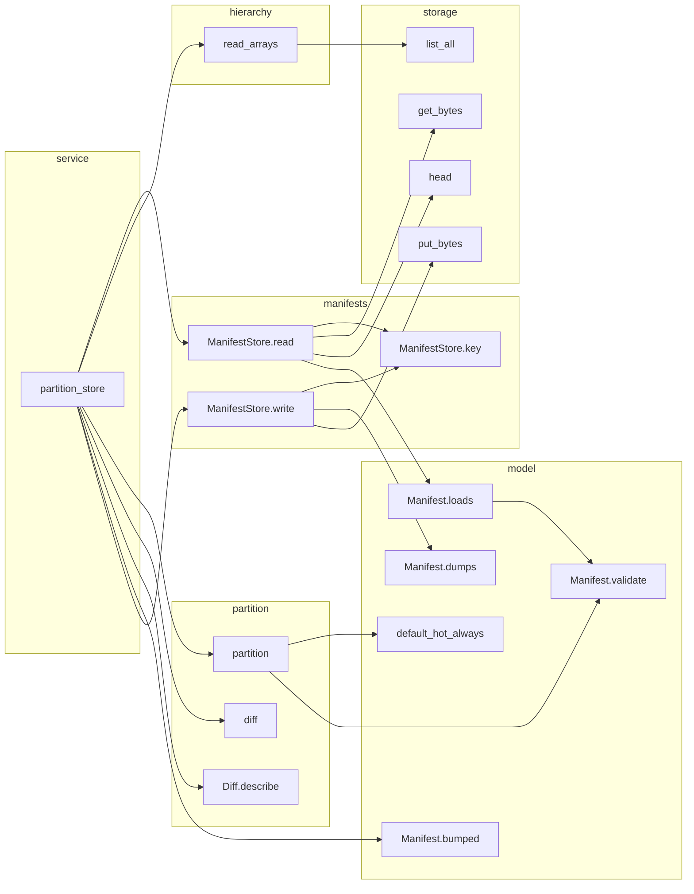
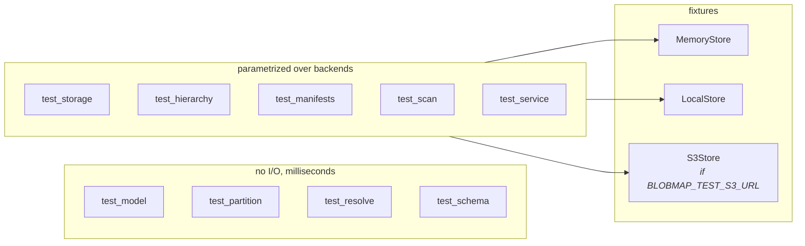

# Internals

For anyone changing the code. Where things live, why the boundaries are where
they are, and how a request moves through.

## Module layers

Dependencies point downward only. Nothing below imports anything above it.

The boxed modules are **pure**: no I/O, no obstore import, no storage handle.
That is where all the logic that matters lives, and it is why the test suite
can exercise the partitioning rules with hand-written dataclasses in
milliseconds. Keep it that way.

`storage` is the only module that imports obstore. Everything else annotates a
handle as `Store`, imported from `storage`, so the dependency stays at one
edge of the package.

## The two flows

Writing definitions and reading them back are almost independent. They share
only the manifest format.

The write path can be slow; it runs once per store. The read path is on the
event stream, so it never touches the network or a database after startup.

## Where the decisions are

`partition.py` is small and worth reading in full. The cut is four rules
applied top down:

Two things to internalise before changing any of it:

**Pinning is unconditional.** When `previous` is passed, its blobs are carried
over verbatim and new cuts only fill unclaimed regions. So a policy change has
no effect on an existing scope. Cuts are frozen once made, because a blob id is
a join key against tape addresses.

**Bucketing is arithmetic, not enumeration.** `b_tas_{n // 2048}` resolves
chunk 5,000,000 without anyone having computed it, which is why appending to a
store needs no manifest change.

## Resolution

The trie holds **one node per cut, never per object**. A store with 300,000
objects contributes a handful of nodes, and a bucketed array is a single node
however many blobs it spans. `Trie.__len__` exists so a test can assert this
has not accidentally started growing per chunk.

A miss is normal and safe. Unpartitioned stores, foreign data and fresh
uploads all resolve to unmanaged, which means hot.

## Call graph

Generated from the AST, so it cannot drift:

    python tools/callgraph.py --entry partition_store --depth 3
    python tools/callgraph.py --module resolve --private
    python tools/callgraph.py                      # everything public

`partition_store`, two levels deep:

Note `read_arrays` calls only `list_all` and `get_bytes`. It never reads a
chunk, which is what makes partitioning safe on cold data: a v3 shard index
lives *inside* the object, so introspecting one would trigger a restore.

## Testing

Nothing is mocked. `MemoryStore` and `LocalStore` are real implementations of
the same API as `S3Store`, so MinIO is one extra fixture param rather than a
second suite.

`tests/zarrgen.py` writes synthetic stores as raw objects with no zarr-python
dependency. That is deliberate: blobmap parses this metadata itself, so the
fixtures must not be produced by the library whose output they imitate.

## Things that will bite

**Changing how a blob id is derived** is a breaking change. Ids join against
tier state and, through it, against tape addresses.

**Adding a field to the manifest** means changing the JSON Schema too. The
schema is the contract, not a derived artifact, and `tests/test_schema.py`
cross-checks the hand-written validator against the real `jsonschema` library.

**`Manifest` validates in `__post_init__`**, so an invalid one cannot exist in
memory. If a test needs a malformed document, build the dict rather than the
dataclass.

**Sharding inverts the naming.** `Array.chunks` in zarr-python is the *inner*
chunk; `Array.shards` is what becomes an object. Reading the wrong one
produces blobs too large by the shard factor, silently. Use
`Array.object_shape`.
