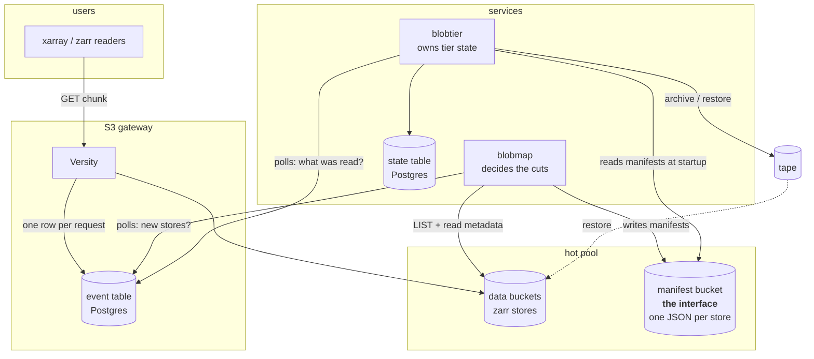
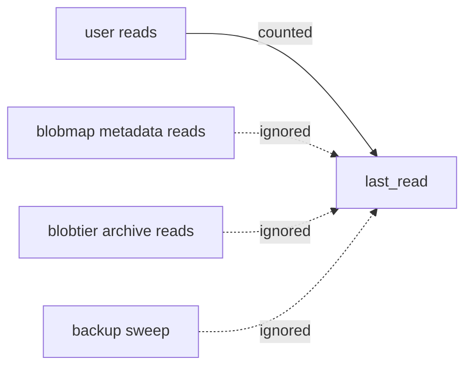
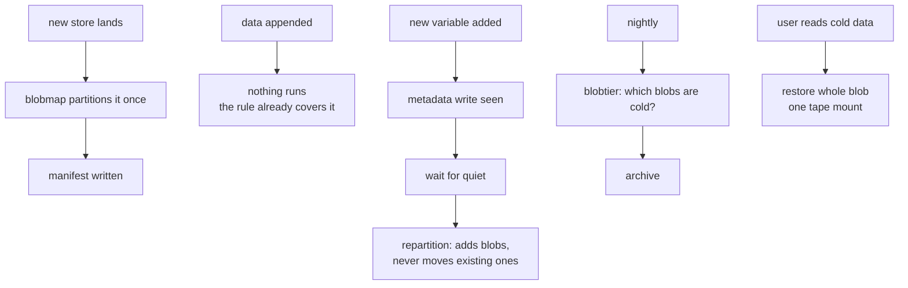

# How it fits together

For anyone running this. What the moving parts are, what they touch, and what
happens when something goes wrong.

## The pieces

**blobmap** decides which objects belong together and writes that down. It runs
occasionally: once per store, plus a check when a store changes.

**blobtier** decides what actually moves, and when. It runs continuously.

The **manifest bucket** is the interface between them. It is small, it is
plain JSON, and it is rebuildable by re-running blobmap.

## What each thing needs access to

| component | data buckets | manifest bucket | event table | state table | tape |
|---|---|---|---|---|---|
| blobmap | read | **write** | read | — | — |
| blobtier | read | read | read | **write** | read/write |

blobmap never writes to the data buckets. That is deliberate and is what lets
it manage data DKRZ does not own.

## Service accounts

Each component needs its own S3 principal, and blobtier must be told to ignore
its own and blobmap's.

This is not cosmetic. The tiering job reads every object in a blob in order to
move it to tape. Without principal filtering, **archiving a blob marks it as
freshly accessed, so it immediately looks hot again** and never gets archived.
The same applies to restores, verification sweeps and backups.

## What runs when

The important one is the second row. Appending to a store needs **no
repartition, no manifest change, and no service to notice**, because the blob
id is computed arithmetically from the chunk number.

## Configuration that matters

**MinIO notifications** must use `format=access`, not `namespace`. `access`
gives an append-only log; `namespace` keeps one upserted row per object key,
which is useless for "what was read".

**`queue_dir` must be set**, so a database blip spools to local disk rather
than dropping events silently.

**The event table needs a retention policy.** An append-only table with no
cleanup is the thing most likely to break this. blobtier reduces roughly
50,000 raw events into a couple of state rows, so the raw table can be
truncated aggressively once both consumers have passed a point.

## Failure modes

| symptom | likely cause |
|---|---|
| nothing ever gets archived | principal filtering not configured, so the tiering job's own reads keep everything looking hot |
| a store is never archived | it has no manifest; run `blobmap scan` to find stores marked `NEW` |
| a new variable stays hot forever | repartition never ran; the metadata-write event was missed or the store is never quiet |
| `open_zarr` hangs | a metadata object or coordinate got archived; this should be impossible, check `hot_always` in the manifest |
| restores are slow and frequent | blobs are too small, or the cut does not match how people read |
| event table growing without bound | no retention policy |

## Recovering

**Manifest bucket lost.** Re-run `blobmap scan --partition` over everything.
The cuts will be recomputed, but blob ids may differ from the originals, so
blobtier's state must be rebuilt too. Worth backing up, since it is small.

**State table lost.** Everything looks cold. Data is still readable, just
slowly, and it re-warms as people use it. This degrades rather than breaks.

**A manifest is wrong.** `blobmap partition <scope> --force` recomputes it.
This is the only operation that can orphan a tape copy, and it says what it
moved.

## Sizing

Two numbers drive everything, and both come from the tape system rather than
from blobmap:

- **mount plus positioning time.** Sets the floor. Below roughly 10 GB, a
  restore is mostly overhead.
- **acceptable restore latency.** Sets the ceiling. A 100 GB blob at typical
  drive speeds is a few minutes; a 1 TB blob is not.
